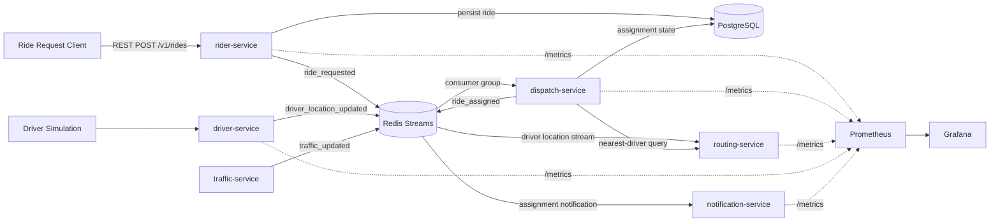
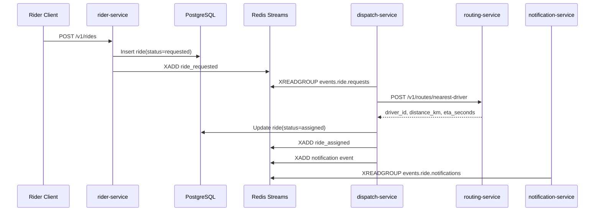
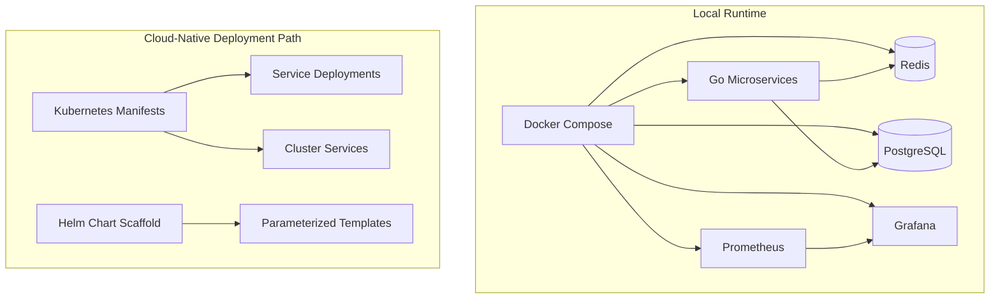

# MetroRide


MetroRide is a production-style distributed ride dispatch platform focused on event-driven backend architecture and cloud-native infrastructure engineering. It models a real-time dispatch domain with independently deployable Go services, Redis Streams for asynchronous coordination, PostgreSQL for durable ride state, and an observability stack built around Prometheus and Grafana.

The project is designed as a backend systems portfolio artifact: the emphasis is service ownership, event contracts, failure boundaries, operational visibility, and a path from local Docker Compose to Kubernetes-based deployment.

## System Architecture



## Event Flow



## Infrastructure Topology



## Service Ownership

| Service | Responsibility | Communication Pattern |
| --- | --- | --- |
| `rider-service` | Accepts ride requests, persists rider-facing state, emits `ride_requested`. | REST ingress, PostgreSQL writes, Redis Streams publish |
| `driver-service` | Simulates live driver coordinates and availability. | Redis Streams publish |
| `dispatch-service` | Consumes ride requests, coordinates driver assignment, persists assignment state. | Redis Streams consumer group, REST call to routing, PostgreSQL writes |
| `routing-service` | Maintains available driver state and calculates nearest-driver ETA. | REST API, Redis Streams consumer |
| `traffic-service` | Produces dynamic congestion updates for future route weighting. | Redis Streams publish |
| `notification-service` | Consumes assignment events and simulates rider/driver delivery. | Redis Streams consumer group |

## Technology Stack

- **Language:** Go for backend services; Python reserved for future simulation or analytics utilities.
- **Event bus:** Redis Streams with consumer groups for durable asynchronous workflows.
- **Storage:** PostgreSQL as the system of record for ride and assignment state.
- **APIs:** REST for synchronous service boundaries, with protobuf/gRPC scaffolding reserved in `shared/proto`.
- **Observability:** Prometheus metrics, Grafana dashboards, structured JSON logs, health and readiness probes.
- **Runtime:** Docker Compose for local orchestration.
- **Cloud-native deployment:** Kubernetes manifests and Helm chart scaffold.

## Distributed Systems Design

MetroRide separates state mutation, assignment coordination, routing computation, and notification delivery into independently deployable services. Ride intake is synchronous only at the API boundary; downstream dispatch work is asynchronous through Redis Streams. This design keeps rider request latency decoupled from assignment processing, makes dispatch consumers horizontally scalable, and provides a foundation for replay, backpressure handling, and transport migration.

Redis Streams are used as the initial event log because they provide persistent streams, consumer groups, explicit acknowledgements, and simple local development ergonomics. The event envelope in `shared/pkg/events` keeps transport concerns isolated so Kafka can be introduced later without rewriting domain payloads.

PostgreSQL remains the authoritative store for ride status. Redis carries workflow events; it does not own long-term ride truth. This separation mirrors production systems where event logs coordinate distributed work while relational storage protects transactional state and queryability.

## System Design Narrative

MetroRide is a production-style local distributed systems project designed to demonstrate backend infrastructure concepts: service decomposition, asynchronous workflow coordination, durable state, reliability controls, and observability. It is not presented as a real production deployment at scale; it is structured so the architecture can be explained and extended like a production backend system.

- [System design](docs/system-design.md)
- [Interview talk track](docs/interview-talk-track.md)
- [Bilingual Interview Q&A](docs/interview-qa-bilingual.md)
- [Architecture decisions](docs/architecture-decisions.md)

## Observability

Every service exposes:

- `GET /healthz`
- `GET /readyz`
- `GET /metrics`

Key metrics include:

- `metroride_ride_requests_total`
- `metroride_dispatch_latency_seconds`
- `metroride_rides_assigned_total`
- `metroride_assignment_failures_total`
- `metroride_stream_consume_errors_total`
- `metroride_dependency_errors_total`
- `metroride_routing_computation_seconds`
- `metroride_active_drivers`

Prometheus scrapes service metrics, and Grafana provisions a MetroRide dashboard with ride request rate, dispatch latency, routing latency, active drivers, and assignment failures.

See [docs/observability.md](docs/observability.md) for the monitoring strategy.

## Reliability and Failure Handling

MetroRide includes production hardening for dependency-aware readiness checks, bounded timeouts, retry behavior, idempotent ride assignment, and a Redis dead-letter stream for failed dispatch events.

See [docs/reliability.md](docs/reliability.md) for timeout strategy, retry behavior, idempotency design, dead-letter semantics, and expected behavior during Redis, PostgreSQL, routing, and dispatch failures.

## Repository Layout

```text
.
├── docker-compose.yml
├── docs/
│   ├── api.md
│   ├── architecture.md
│   ├── architecture-decisions.md
│   ├── interview-qa-bilingual.md
│   ├── interview-talk-track.md
│   ├── observability.md
│   ├── reliability.md
│   ├── resume-bullets.md
│   └── system-design.md
├── infrastructure/
│   ├── docker/
│   ├── grafana/
│   ├── helm/
│   ├── k8s/
│   └── prometheus/
├── scripts/
│   └── smoke-test.sh
├── services/
│   ├── dispatch-service/
│   ├── driver-service/
│   ├── notification-service/
│   ├── rider-service/
│   ├── routing-service/
│   └── traffic-service/
└── shared/
    ├── events/
    ├── pkg/
    └── proto/
```

## Local Development

Start the platform:

```bash
docker compose up --build
```

Create a ride:

```bash
curl -X POST http://localhost:8080/v1/rides \
  -H 'Content-Type: application/json' \
  -d '{"rider_id":"rider-42","pickup_lat":37.775,"pickup_lng":-122.419,"dropoff_lat":37.789,"dropoff_lng":-122.401}'
```

Query the ride state:

```bash
curl http://localhost:8080/v1/rides/<ride_id>
```

Run the smoke test:

```bash
bash scripts/smoke-test.sh
```

## Runtime Ports

| Component | Port |
| --- | ---: |
| `rider-service` | `8080` |
| `driver-service` | `8081` |
| `dispatch-service` | `8082` |
| `routing-service` | `8083` |
| `traffic-service` | `8084` |
| `notification-service` | `8085` |
| Prometheus | `9090` |
| Grafana | `3000` |
| PostgreSQL | `5432` |
| Redis | `6379` |

Grafana defaults to `admin` / `admin`.

## Deployment

Docker Compose is the primary local runtime:

```bash
docker compose up --build
```

Kubernetes manifests live in `infrastructure/k8s`:

```bash
kubectl apply -f infrastructure/k8s/namespace.yaml
kubectl apply -f infrastructure/k8s/
```

Helm scaffold lives in `infrastructure/helm/metro-ride`:

```bash
helm install metro-ride infrastructure/helm/metro-ride
```

The Kubernetes and Helm artifacts are intentionally scaffolded for production evolution: image registries, secrets management, persistent volumes, ingress, autoscaling, and service monitors can be layered in without changing service code.

## Documentation

- [Architecture](docs/architecture.md)
- [System design](docs/system-design.md)
- [Interview talk track](docs/interview-talk-track.md)
- [Bilingual Interview Q&A](docs/interview-qa-bilingual.md)
- [Architecture decisions](docs/architecture-decisions.md)
- [API](docs/api.md)
- [Observability](docs/observability.md)
- [Reliability](docs/reliability.md)
- [Resume bullets](docs/resume-bullets.md)

## Scalability Roadmap

- **Kafka migration:** Replace Redis Streams with Kafka while preserving the shared event envelope.
- **gRPC service mesh:** Move dispatch-to-routing calls to protobuf/gRPC with deadlines and retries.
- **Distributed tracing:** Add OpenTelemetry spans across ride intake, stream consumption, routing, and notification delivery.
- **Autoscaling:** Scale dispatch consumers based on stream lag and assignment latency.
- **Multi-region deployment:** Partition drivers and rides by region, then replicate critical events across regions.
- **AI-assisted ETA prediction:** Introduce an ETA model service using traffic, driver, and route features.
- **Demand forecasting:** Add regional demand prediction to pre-position driver supply.
- **Resilience hardening:** Add dead-letter streams, idempotency keys, retry budgets, and circuit breakers.
