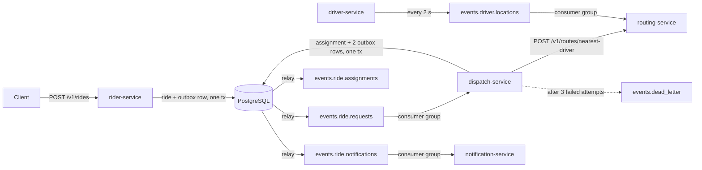

# MetroRide

[](https://github.com/96528025/MetroRide/actions/workflows/ci.yml)


**A ride-dispatch backend in Go that keeps its database and its event stream in agreement when things fail.** A rider posts a trip; six small services persist it, pick the nearest driver, commit the assignment, and fan the result out over Redis Streams. PostgreSQL is the source of truth, Redis Streams carries the workflow, and ride and assignment state changes are committed together with the events announcing them (a transactional outbox). Driver locations and traffic updates are simulated telemetry and go straight to Redis.

This is a portfolio-scale systems project, not a production service. What it demonstrates is concrete: service boundaries, at-least-once delivery with an idempotent dispatch transition, 2-second dependency deadlines with three-attempt consumer retries, a dead-letter path for failed dispatches, integration tests against the real stack, and a Helm release that CI installs and drives end to end on a throwaway Kubernetes cluster.

## What is interesting here

- **No lost events, no dual-write gap.** `rider-service` and `dispatch-service` write their domain rows and an `event_outbox` row in the same PostgreSQL transaction; a per-service relay publishes committed rows to Redis with `FOR UPDATE SKIP LOCKED`. CI proves it: Redis is stopped, a ride is accepted with HTTP 202, and after Redis returns the ride is assigned with no client retry.
- **Duplicate-safe assignment.** Dispatch checks persisted state, then updates `rides ... where status = 'requested'` and inserts the assignment in one transaction. An integration test replays the same `ride_requested` event and asserts exactly one `ride_assignments` row.
- **Failures are bounded and inspectable.** Request-path Redis, PostgreSQL and routing calls run under 2-second deadlines (deferred transaction rollbacks use a background context); message handling retries 3 times (150 ms, doubling); if that fails, dispatch writes a record to `events.dead_letter` and only then acknowledges the message. A CI test stops `routing-service` and asserts the dead letter and the untouched ride.
- **Delivery is validated, not just packaged.** Six distroless, non-root images tagged with the full commit SHA are installed via Helm into an ephemeral KinD cluster inside the CI runner, a ride is driven through them, and the result is checked over HTTP, in PostgreSQL, and at the notification consumer.

## Architecture


```mermaid
flowchart LR
    Client -->|POST /v1/rides| Rider[rider-service]
    Rider -->|ride + outbox row, one tx| DB[(PostgreSQL)]
    DB -->|relay| RQ[events.ride.requests]
    RQ -->|consumer group| Dispatch[dispatch-service]
    Dispatch -->|POST /v1/routes/nearest-driver| Routing[routing-service]
    Driver[driver-service] -->|every 2 s| DL[events.driver.locations]
    DL -->|consumer group| Routing
    Dispatch -->|assignment + 2 outbox rows, one tx| DB
    DB -->|relay| RA[events.ride.assignments]
    DB -->|relay| RN[events.ride.notifications]
    RN -->|consumer group| Notify[notification-service]
    Dispatch -.->|after 3 failed attempts| DLQ[events.dead_letter]
```

`POST /v1/rides` returns `202` before dispatch runs; clients poll `GET /v1/rides/{ride_id}` until `status` is `assigned`.

### Services

Six core services form the default Docker Compose profile, the Helm chart, and the published image set. A seventh, `analytics-service`, exists only behind the optional `kafka` Compose profile.

| Service | Port | Does | Depends on |
| --- | --- | --- | --- |
| `rider-service` | 8080 | Accepts and reads rides; commits ride + outbox row; runs its relay | PostgreSQL (readiness), Redis (relay only) |
| `driver-service` | 8081 | Moves four simulated drivers; publishes locations every 2 s | Redis; Kafka when enabled |
| `dispatch-service` | 8082 | Consumes ride requests, calls routing, commits assignment + outbox rows, dead-letters failures | PostgreSQL, Redis, routing-service |
| `routing-service` | 8083 | Keeps an in-memory driver view; returns nearest available driver (`haversine-nearest`, O(n) scan, ETA at 32 km/h with a 60 s floor) | Redis |
| `traffic-service` | 8084 | Publishes simulated congestion every 10 s (not yet consumed) | Redis |
| `notification-service` | 8085 | Consumes assignment notifications; logs them and counts them | Redis |
| `analytics-service` | 8086 | Optional Kafka consumer; latest location per driver at `GET /v1/analytics/drivers` | Kafka |

### Streams

| Stream | Producer | Consumer | Published via |
| --- | --- | --- | --- |
| `events.ride.requests` | rider-service | dispatch-service (group) | outbox relay |
| `events.driver.locations` | driver-service | routing-service (group) | direct `XADD` |
| `events.ride.assignments` | dispatch-service | none yet | outbox relay |
| `events.ride.notifications` | dispatch-service | notification-service (group) | outbox relay |
| `events.traffic.updates` | traffic-service | none yet | direct `XADD` |
| `events.dead_letter` | dispatch-service | none (inspection) | direct `XADD`, 3 attempts |

## Quick start

Prerequisites: Docker with Compose, `curl`. Go 1.22 is needed only for the Go test commands.

```bash
docker compose up --build -d
bash scripts/smoke-test.sh          # waits for /healthz + /readyz on all six, creates a ride, waits for "assigned"
```

Or by hand:

```bash
curl -X POST http://localhost:8080/v1/rides \
  -H 'Content-Type: application/json' \
  -d '{"rider_id":"rider-42","pickup_lat":37.775,"pickup_lng":-122.419,"dropoff_lat":37.789,"dropoff_lng":-122.401}'

curl http://localhost:8080/v1/rides/<ride_id>
```

Also running: PostgreSQL `localhost:5432`, Redis `localhost:6379`, Prometheus `http://localhost:9090`, Grafana `http://localhost:3000` (`admin` / `admin`, dashboard provisioned). `docker compose down` stops the stack and keeps the named volumes; `docker compose down -v` removes them.

Optional Kafka telemetry (single KRaft broker, topic `metroride.driver.location.v1` with 3 partitions keyed by `driver_id`, a second `driver-service` process producing every 10 s, `analytics-service` consuming):

```bash
docker compose --profile kafka up --build -d
ENABLE_KAFKA_SMOKE=true bash scripts/smoke-test.sh
```

## Reliability design

**Transactional outbox, at-least-once.** `outbox.Enqueue` inserts the full event envelope inside the caller's transaction. Each service's relay polls every 250 ms, locks up to 25 unpublished rows with `FOR UPDATE SKIP LOCKED`, publishes each to its stream, and records `published_at`. A failed row gets `publish_attempts`, `last_error`, and a `next_attempt_at` set by exponential backoff capped at 30 s; eligible rows are ordered by that time so a poison row cannot monopolise a batch. There is no attempt ceiling and no outbox dead-letter path: a permanently undeliverable row retries forever at the 30 s cap. A crash between Redis accepting an event and PostgreSQL recording it republishes the same envelope ID, so any consumer with a non-repeatable side effect has to be idempotent; today only dispatch's state transition is. This is idempotent state mutation on top of at-least-once delivery.

**Idempotent dispatch.** Before routing, dispatch reads the ride; if it is no longer `requested` or already has a driver, the event is skipped. The write is `update rides set ... where id = $1 and status = 'requested'`; zero rows affected means another worker won, and the transaction rolls back without an assignment row. Tests run a single dispatch replica; the guard is designed to hold for competing workers but that case is not exercised.

**Bounded dependency work.** Redis, PostgreSQL and routing contexts: 2 s. Readiness checks: 1.5 s. `reliability.Retry`: 3 attempts, 150 ms initial delay, doubling, cancellable. HTTP servers set read-header/read/write/idle timeouts (5/10/15/60 s) and drain on `SIGINT`/`SIGTERM`.

**Consumers.** Dispatch is the idempotent consumer; notification-service logs and counts every delivery, so a redelivered assignment produces a second log line and count. When dispatch exhausts its retries, it publishes a `dead_lettered` envelope (original event ID and type, ride ID, error, service, timestamp) to `events.dead_letter`, retrying that publish up to 3 times, and acknowledges the original only if it succeeded. Consumers read new entries only; abandoned pending entries are not reclaimed (`XAUTOCLAIM`/`XCLAIM` is future work).

**Operability.** Every service serves `GET /healthz`, `GET /readyz` (named checks for the service's PostgreSQL, Redis and routing dependencies; rider-service deliberately depends only on PostgreSQL so intake stays up during a Redis outage; the optional Kafka producer is not probed), and `GET /metrics`. Logs are JSON with `service`, `ride_id`, `driver_id`, `event_type`, and `error` fields. Metrics: `metroride_ride_requests_total`, `metroride_rides_assigned_total`, `metroride_dispatch_latency_seconds`, `metroride_assignment_failures_total`, `metroride_stream_consume_errors_total`, `metroride_dependency_errors_total`, `metroride_outbox_events_published_total`, `metroride_outbox_publish_failures_total`, `metroride_routing_computation_seconds`, `metroride_active_drivers`.

## Verification

`go test -race ./...` compiles all 15 Go packages and runs 33 unit tests across 8 of them (event envelopes, config, HTTP/readiness helpers, retry and timeout helpers, the dispatch-to-routing client, nearest-driver selection and tie-breaking, outbox backoff, rider readiness). The other 7 packages have no unit tests. The race detector is a guard for future concurrent code: none of the unit tests exercise concurrent paths today, and the services under test run uninstrumented in containers, so it says nothing about relay or consumer concurrency. Running-stack tests need the Compose stack up:

| Check | Command | Asserts |
| --- | --- | --- |
| Smoke | `bash scripts/smoke-test.sh` | `/healthz` and `/readyz` on all six services, selected metrics, HTTP 202 on create, ride reaches `assigned` with a driver |
| Integration (3 tests) | `go test -race -count=1 -tags=integration ./tests/integration` | happy path; duplicate `ride_requested` keeps one assignment and the same driver; outbox relay makes progress past 25 real Redis `WRONGTYPE` failures without replaying delivered rows |
| Redis outage | `bash scripts/outbox-recovery-test.sh` | rider stays ready, ride accepted with 202, one unpublished outbox row in PostgreSQL, automatic relay and assignment after Redis restarts |
| Process kill | `bash scripts/process-kill-recovery-test.sh` | with Redis stopped, ride accepted with 202 and one unpublished outbox row; rider-service killed with SIGKILL; after `docker compose up -d redis rider-service` the restarted relay publishes that row exactly once and dispatch assigns the ride, with no client retry |
| Routing outage (1 test) | `bash scripts/failure-integration-test.sh` | dead-letter entry matches the ride and original event ID; ride stays `requested` with zero assignment rows |
| Kubernetes (needs Docker, kind, kubectl, Helm and Bash 4+ for `mapfile`; macOS ships Bash 3.2) | `bash scripts/build-images.sh && bash scripts/kind-up.sh && bash scripts/kind-load-images.sh && bash scripts/kind-deploy.sh && bash scripts/kind-smoke-test.sh` | same smoke test through `kubectl port-forward`, then `rides`/`ride_assignments` checked with `psql` and the notification counter checked over HTTP; `bash scripts/kind-down.sh` deletes the cluster |

Opt-in benchmark for the 10,000-driver selection scan: `go test -run '^$' -bench BenchmarkSelectNearestDriver10000 -benchmem ./services/routing-service/cmd`. No end-to-end latency or throughput numbers are claimed.

## Delivery pipeline

One GitHub Actions workflow (`.github/workflows/ci.yml`) plus a reusable deployment job (`deploy-validation.yml`). Triggers: pull requests, pushes to `main`, `v*` tags, manual dispatch.

1. **`backend`** (every event): `gofmt -l`, `go vet`, `go test -race ./...`, `docker compose config`, build and start the stack, then the smoke, integration, Redis-outage, process-kill and routing-outage checks above; Compose logs on failure; `docker compose down -v` always.
2. **Pull requests**: build the six images in the runner, create a single-node KinD cluster (`kindest/node:v1.34.0`; kind, kubectl and Helm versions pinned), side-load the images with `kind load docker-image`, `helm upgrade --install --wait`, run the Kubernetes smoke test, collect diagnostics on failure, delete the cluster unconditionally. The job has `contents: read` only, never logs in to GHCR, and neither pushes nor pulls MetroRide service images; base images, the KinD node image, PostgreSQL and Redis are still pulled from public registries.
3. **`main`, tags, manual runs**: a six-way matrix publishes `ghcr.io/96528025/metroride-<service>:<full-commit-sha>` (plus the `v*` tag when present; never `latest`), then the same KinD job pulls those exact images back, logs out of GHCR before the cluster exists, and runs the identical deployment and smoke test.

The Helm chart (`infrastructure/helm/metro-ride`) packages the six core services with resource requests/limits, liveness/readiness probes, bounded init-container waits (`redis-cli ping`, `pg_isready`, 180 s), a config-checksum annotation that rolls pods on config change, and a `ServiceMonitor` rendered only when the Prometheus Operator CRD is present. Its defaults expect external PostgreSQL and Redis; the KinD profile enables chart-owned, `emptyDir`-backed test instances, one replica per service, and omits Prometheus and Grafana. The image list loaded into KinD is derived from the rendered manifests, and the database schema (`infrastructure/docker/postgres/init.sql`) is shared between Compose and the chart. This is deployment validation inside a CI runner, not hosting: nothing persists after the job.

## Limitations

- Outbox delivery is at-least-once with no attempt ceiling and no outbox dead-letter path; the relay holds row locks while publishing.
- Stream consumers do not reclaim pending entries after a crash; dead-letter replay tooling does not exist.
- Routing state is process-local. CI runs one routing replica; the chart's untested defaults set two, which this design does not support without partitioned or shared driver state.
- Routing seeds three static placeholder drivers at startup in addition to the four simulated ones; availability is never reserved on assignment; traffic events are produced but unused; notifications are a log line and a counter.
- Distance is Haversine, not road routing. There is a 10,000-driver in-process benchmark and no load test.
- No authentication, TLS, rate limiting, secrets management, persistent Kubernetes storage, autoscaling, tracing, or hosted deployment.
- The Kafka profile is a non-persistent single broker outside the CI-gated release.

## Documentation

[Architecture](docs/architecture.md) · [System design](docs/system-design.md) · [Architecture decisions](docs/architecture-decisions.md) · [API](docs/api.md) · [Reliability](docs/reliability.md) · [Observability](docs/observability.md) · [Testing and CI](docs/testing-and-ci.md) · [CI/CD pipeline](docs/cicd.md) · [Performance](docs/performance.md) · [Kafka extension](docs/kafka-lightweight-extension.md)

## License

MIT. See [LICENSE](LICENSE).
