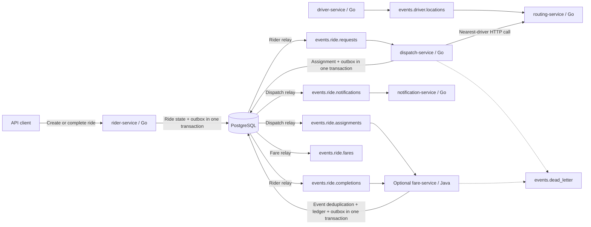

# MetroRide — Event-Driven Dispatch and Fare Settlement

[](https://github.com/96528025/MetroRide/actions/workflows/ci.yml)


**A ride-dispatch backend that demonstrates reliable event delivery, duplicate-safe state changes, and a double-entry fare ledger.** A rider creates a trip, Go services assign a nearby simulated driver, and an optional Java/Spring Boot service records a quote hold and settles it when the ride is completed.

The project focuses on **backend engineering, event-driven systems, database transactions, failure recovery, and container delivery**. It has six core Go services, an optional Java fare service, and an optional Kafka analytics extension. There is no rider/driver frontend; Grafana supplies operational dashboards. Kubernetes deployment is validated in disposable CI clusters, with no continuously hosted application claimed.

## Engineering highlights

| Problem | Implemented approach | Evidence |
| --- | --- | --- |
| Database commits but event publishing fails | Domain changes and outbox rows commit in one PostgreSQL transaction; a relay retries publishing to Redis | [`shared/pkg/outbox`](shared/pkg/outbox), Redis-outage and process-kill recovery scripts |
| A ride request is delivered again | Conditional `requested → assigned` update and assignment insert in one transaction | [`dispatch-service`](services/dispatch-service/cmd/main.go), duplicate-event integration test |
| Completion or settlement is attempted twice | Conditional `assigned → completed` update; fare event-ID deduplication, quote-hold row lock, per-ride unique indexes | [`rider-service`](services/rider-service/cmd/main.go), [`fare-service`](services/fare-service/README.md), concurrent completion/settlement tests |
| A consumer crashes or receives unusable data | Fare consumer reclaims pending entries, classifies failures, and dead-letters before acknowledging | `RideEventConsumer`, `FailureHandler`, Testcontainers recovery tests |
| Images build but fail when deployed | CI installs the six core images through Helm into KinD and drives a ride through the deployed stack | [Deployment workflow](.github/workflows/deploy-validation.yml) |

## Run locally

Prerequisites: Docker with Compose and curl. Go 1.22 is needed for Go tests; Java 21 is needed for local Maven commands.

```bash
docker compose up --build -d
bash scripts/smoke-test.sh
```

The smoke test waits for health/readiness on all six core services, creates a ride, and waits for an assignment. For a manual request:

```bash
curl -X POST http://localhost:8080/v1/rides \
  -H 'Content-Type: application/json' \
  -d '{"rider_id":"rider-42","pickup_lat":37.775,"pickup_lng":-122.419,"dropoff_lat":37.789,"dropoff_lng":-122.401}'
```

Copy the returned `ride_id` into a shell variable and poll until `status` is `assigned`:

```bash
RIDE_ID='paste-returned-ride-id-here'
curl "http://localhost:8080/v1/rides/$RIDE_ID"
```

To include the fare workflow, enable its profile **before creating a new demo ride**:

```bash
docker compose --profile fare up --build -d
```

After that ride is assigned, inspect its quote hold, complete it, and poll its ledger for settlement:

```bash
curl "http://localhost:8087/v1/rides/$RIDE_ID/ledger"
curl -X POST "http://localhost:8080/v1/rides/$RIDE_ID/complete"
curl "http://localhost:8087/v1/rides/$RIDE_ID/ledger"
```

Completion returns `202` when the ride changes to `completed`; the ledger updates asynchronously. A second completion returns `409`. Creating another ride requires another `POST /v1/rides` request; the API does not deduplicate client create requests.

Prometheus runs at `http://localhost:9090`, Grafana at `http://localhost:3000` with local demo credentials `admin` / `admin`, PostgreSQL on `5432`, and Redis on `6379`. `docker compose --profile fare down` stops the core/fare stack and preserves named data volumes; add `--profile kafka` if that extension is running too.

## Architecture


```mermaid
flowchart LR
    C[API client] -->|Create or complete ride| Rider[rider-service / Go]
    Rider -->|Ride state + outbox in one transaction| DB[(PostgreSQL)]
    DB -->|Rider relay| Requests[events.ride.requests]
    Requests --> Dispatch[dispatch-service / Go]
    Driver[driver-service / Go] --> Locations[events.driver.locations]
    Locations --> Routing[routing-service / Go]
    Dispatch -->|Nearest-driver HTTP call| Routing
    Dispatch -->|Assignment + outbox in one transaction| DB
    DB -->|Dispatch relay| Assignments[events.ride.assignments]
    DB -->|Dispatch relay| Notifications[events.ride.notifications]
    Notifications --> Notify[notification-service / Go]
    DB -->|Rider relay| Completions[events.ride.completions]
    Assignments --> Fare[Optional fare-service / Java]
    Completions --> Fare
    Fare -->|Event deduplication + ledger + outbox in one transaction| DB
    DB -->|Fare relay| Fares[events.ride.fares]
    Dispatch -.-> DLQ[events.dead_letter]
    Fare -.-> DLQ
```

The core data path uses HTTP/JSON, PostgreSQL, and Redis Streams. The repository's `shared/proto` directory is not evidence of an implemented gRPC transport. Traffic simulation and optional Kafka telemetry are separate from the dispatch path shown above.

| Service | Port | Responsibility | Default stack |
| --- | ---: | --- | --- |
| `rider-service` | 8080 | Create/read rides, complete assigned rides, publish through its outbox relay | Yes |
| `driver-service` | 8081 | Publish locations for four simulated drivers every two seconds | Yes |
| `dispatch-service` | 8082 | Consume requests, call routing, persist assignment and two outbox destinations | Yes |
| `routing-service` | 8083 | Maintain an in-memory driver view; select nearest available driver | Yes |
| `traffic-service` | 8084 | Publish simulated congestion every ten seconds; currently no consumer | Yes |
| `notification-service` | 8085 | Log and count notification deliveries | Yes |
| `analytics-service` | 8086 | Expose latest driver locations consumed from Kafka | Optional `kafka` profile |
| `fare-service` | 8087 | Consume assignments/completions; quote, hold, settle, expose the ledger, and publish `fare_settled` through its own outbox relay | Optional `fare` profile |

## A ride from request to settlement

1. **Accept.** `POST /v1/rides` inserts a `requested` ride and its `ride_requested` outbox envelope in one PostgreSQL transaction. HTTP `202` means acceptance, not assignment. Rider readiness checks PostgreSQL, allowing intake to continue while Redis is unavailable.
2. **Publish.** The rider relay publishes the committed envelope to `events.ride.requests`. Dispatch reads it through a consumer group.
3. **Select.** Routing scans available drivers with Haversine distance, using driver ID for deterministic ties. Complexity is O(n); ETA assumes 32 km/h with a 60-second minimum.
4. **Assign.** Dispatch updates the ride only if it is still `requested`, inserts the assignment, and enqueues the assignment envelope for both `events.ride.assignments` and `events.ride.notifications` in one transaction. Replayed requests cannot repeat that state transition.
5. **Hold.** If enabled, fare-service records the assignment envelope ID and a balanced `quote_hold` in its own PostgreSQL transaction. Notifications independently log/count the event.
6. **Complete.** `POST /v1/rides/{ride_id}/complete` changes only an `assigned` ride, requires exactly one assignment row, and enqueues `ride_completed` atomically. Unknown rides return `404`, other statuses return `409`, and inconsistent assignment state returns `500` with the transaction rolled back.
7. **Settle.** Fare-service deduplicates the completion event, locks the existing hold, reverses it, writes the settlement, and enqueues a `fare_settled` envelope in `fare.event_outbox`, all in one transaction, before acknowledging the message.
8. **Announce.** The fare relay publishes that envelope to `events.ride.fares` (ride, rider, driver and assignment IDs, the completion event ID, quote, driver and platform amounts as decimal strings). Nothing in this repository consumes it yet.

## Fare ledger and pricing boundary

The Java service uses Spring Boot, JPA for processed-event records, JDBC for ledger operations, Flyway migrations in the `fare` schema, and `BigDecimal` money values rounded once to two decimal places.

```text
quote = 2.50 + 1.20 × distance_km + 0.30 × eta_seconds / 60
driver share = round_to_cents(quote × 0.80)
platform share = quote − driver share
```

These are the default configurable rates. **The current assignment distance/ETA describe the selected driver travelling to the pickup point.** Drop-off coordinates are accepted by rider-service but are not used by nearest-driver routing or fare calculation. The ledger demonstrates settlement by the stored quote; it does not meter the passenger trip or collect real payments.

For an illustrative quote of `10.00`, entries use positive debit and negative credit amounts:

| Entry | Postings | Sum |
| --- | --- | ---: |
| `quote_hold` | `rider_receivable +10.00`, `fare_hold -10.00` | 0.00 |
| `hold_reversal` | `rider_receivable -10.00`, `fare_hold +10.00` | 0.00 |
| `settlement` | `rider_receivable +10.00`, `driver_payable -8.00`, `platform_revenue -2.00` | 0.00 |

The immutable `JournalEntry` constructor enforces balance. PostgreSQL transactions keep event deduplication and ledger writes together; unique indexes enforce one quote hold and one settlement per ride. There is no database trigger independently enforcing the sum of all postings, and no payment gateway, payout, refund, or trip adjustment workflow.

Failure classification matters because assignments and completions travel through different relays/streams:

| Condition | Fare-service behavior |
| --- | --- |
| Same envelope delivered again | Event-ID conflict; skip ledger mutation and acknowledge |
| Completion arrives before its hold | Roll back and leave pending for retry |
| Retryable failure reaches 25 deliveries | Dead-letter, then acknowledge only after confirmed publication |
| Malformed/poison payload | Dead-letter immediately, then acknowledge |
| Corrupt hold, duplicate hold, or already-settled ride | Quarantine through a reason-labelled dead letter |
| Multiple holds despite the unique index, or fatal schema/code failure | Halt consumer, leave the entry pending, fail readiness |

Pending recovery uses `XAUTOCLAIM` with a retained cursor, a five-second reclaim interval, and five-second minimum idle time by default. A missing hold can still exhaust the delivery budget during a prolonged outage. [Full service design and recovery runbook](services/fare-service/README.md).

## Reliability and operational limits

**Outbox delivery is at-least-once.** Relays poll every 250 ms, lock up to 25 eligible rows using `FOR UPDATE SKIP LOCKED`, publish, and mark them published. Failed rows receive exponential backoff capped at 30 seconds, with no attempt ceiling. Locks remain held while publishing. If Redis accepts an event and the relay crashes before recording publication, the envelope can be published again. The Java fare relay runs the same statements and backoff against `fare.event_outbox` in its own schema, bounds each statement, the commit and each publish separately rather than the batch as a whole, and shares the same crash window, which no test on either side automates.

**Idempotency is scoped to side effects.** Dispatch guards assignment, rider-service guards completion, and fare-service deduplicates ledger events. Notification logs/counters repeat on redelivery. The Go stream consumers read new entries only and do not reclaim abandoned pending entries; the Java fare consumer implements that recovery. Dead-letter replay tooling is not included.

**Timeouts apply per operation.** Core Redis, PostgreSQL, and routing operations use two-second deadlines. Retry helpers use three attempts with 150 ms initial backoff, doubling. Dispatch has both an outer message retry and an inner routing-call retry: an unavailable routing dependency can receive up to nine HTTP attempts for one message. This is not a two-second end-to-end dispatch deadline. Deferred Go transaction rollbacks use a background context.

**Routing is a simulation.** It seeds three placeholder drivers in addition to four simulated drivers, stores locations in process memory, and does not reserve a driver on assignment. Consumer-group delivery does not broadcast a complete location view to every routing replica. CI uses one replica; the chart's two-replica defaults do not establish correct multi-replica routing.

Services expose `/healthz`, `/readyz`, and `/metrics`; JSON logs include identifiers useful for following a ride. Compose provisions Prometheus and Grafana. The project does not include authentication, TLS, rate limiting, distributed tracing, production secrets management, or a measured end-to-end capacity target.

## Verification

| Check | Command | What it exercises |
| --- | --- | --- |
| Go unit tests | `go test -race ./...` | Event/config/HTTP contracts, retries, routing selection, outbox backoff, completion response mapping, cancellation |
| Core smoke | `bash scripts/smoke-test.sh` | Health/readiness, metrics, ride acceptance and assignment |
| Running-stack integration | `go test -race -count=1 -tags=integration ./tests/integration` | Seven test functions covering assignment, duplicate delivery, outbox progress, completion rejection, single/concurrent completion, rollback |
| Redis outage | `bash scripts/outbox-recovery-test.sh` | Intake accepts a ride while Redis is down; relay delivers after recovery |
| Process kill | `bash scripts/process-kill-recovery-test.sh` | Persisted outbox work survives rider-service `SIGKILL` and is relayed after restart |
| Routing outage | `bash scripts/failure-integration-test.sh` | Failed dispatch produces the expected dead letter and leaves the ride unassigned |
| Fare unit tests | `cd services/fare-service && ./mvnw -B test` | Pricing, money, ledger invariants, event contracts, failure policy |
| Fare integration | `cd services/fare-service && ./mvnw -B verify` | Unit tests plus real PostgreSQL/Redis Testcontainers tests, deduplication, settlement races, lock waits, pending recovery |

Stack integration and outage scripts require the local Compose stack. Fare `verify` needs Java 21 and Docker. The Go race detector instruments Go test processes; it does not instrument the independently running service containers.

Optional selection microbenchmark:

```bash
go test -run '^$' -bench BenchmarkSelectNearestDriver10000 -benchmem ./services/routing-service/cmd
```

This times a 10,000-driver in-process scan, not end-to-end ride throughput.

## Delivery pipeline and optional Kafka

[CI](.github/workflows/ci.yml) validates Go formatting, vet/tests, Compose, smoke/integration, and outage recovery. A separate Java job runs Maven `verify`. Six core images are built as distroless, non-root containers.

- **Pull requests:** build images in the runner, load them into KinD, install the Helm release, and run deployment smoke checks without publishing service images.
- **Main, release tags, manual runs:** publish core images tagged with the full commit SHA to GHCR, pull those artifacts into the deployment-validation job, and run the same KinD checks. No `latest` tag is used.
- **Scope:** the publish job depends on Go backend validation; fare validation is a separate job and is not a dependency of image publication. Fare and analytics are outside the six-image release/Helm smoke path. KinD clusters are removed after validation.

The [Helm chart](infrastructure/helm/metro-ride) includes probes, resource settings, bounded dependency waits, and optional `ServiceMonitor` rendering. Default dependencies are external PostgreSQL/Redis; KinD profiles use disposable `emptyDir`-backed instances. Local deployment validation needs Docker, kind, kubectl, Helm, and Bash 4+; see [CI/CD documentation](docs/cicd.md).

The optional Kafka profile runs a non-persistent single KRaft broker, a three-partition driver-location topic keyed by `driver_id`, a separate telemetry producer, and the analytics consumer:

```bash
docker compose --profile kafka up --build -d
ENABLE_KAFKA_SMOKE=true bash scripts/smoke-test.sh
```

Kafka is a telemetry extension; Redis Streams remains the ride workflow transport.

## Repository guide

[Architecture](docs/architecture.md) · [API](docs/api.md) · [Reliability](docs/reliability.md) · [Fare service](services/fare-service/README.md) · [Observability](docs/observability.md) · [Testing](docs/testing-and-ci.md) · [Deployment](docs/cicd.md) · [Kafka extension](docs/kafka-lightweight-extension.md)

The root README describes the combined current workflow. Service-specific source, migrations, and tests provide the detailed behavioral contracts.

## License

MIT. See [LICENSE](LICENSE).
