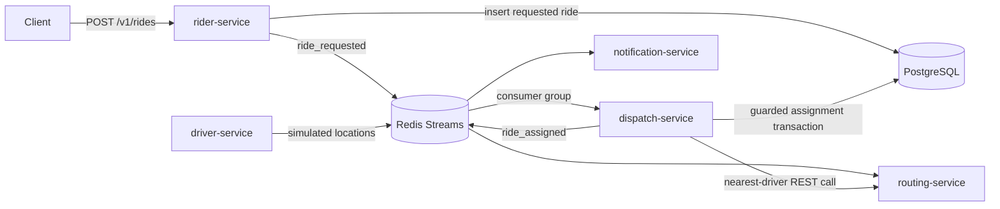

# MetroRide

[](https://github.com/96528025/MetroRide/actions/workflows/ci.yml)


**An event-driven ride-dispatch backend built in Go.** MetroRide separates ride intake, simulated driver telemetry, dispatch, routing, traffic, and notification into six runnable services. PostgreSQL owns ride state, Redis Streams coordinates asynchronous work, and Prometheus/Grafana make the local system observable.

This is a portfolio-scale systems project, not a production ride-hailing service. Its focus is concrete backend behavior: service boundaries, duplicate-safe state transitions, bounded failure handling, running-stack integration tests, and reproducible container/Kubernetes delivery.

## Engineering Snapshot

| Area | Implemented evidence |
| --- | --- |
| Service architecture | Six Go services; REST at the client and routing boundaries; Redis Streams consumer groups for dispatch and notification |
| State and consistency | PostgreSQL ride/assignment schema; assignment update and insert in one transaction; guarded `status = 'requested'` transition |
| Reliability | Two-second dependency deadlines, three-attempt exponential-backoff helper, dependency-aware readiness, dead-letter stream |
| Observability | Structured JSON logs, Prometheus metrics, provisioned Grafana dashboard, `/healthz`, `/readyz`, and `/metrics` |
| Verification | Compose smoke test, two tagged integration tests, one routing-outage test, and a post-deployment KinD smoke test |
| Delivery | Six non-root service images; immutable commit-SHA tags; Helm release installed in an ephemeral KinD cluster in CI |
| Optional streaming | Single-broker Kafka profile for driver-location telemetry and an in-memory analytics view; separate from core dispatch |

## Core Request Path


```mermaid
flowchart LR
    Client[Client] -->|POST /v1/rides| Rider[rider-service]
    Rider -->|insert requested ride| DB[(PostgreSQL)]
    Rider -->|ride_requested| Redis[(Redis Streams)]
    Redis -->|consumer group| Dispatch[dispatch-service]
    Driver[driver-service] -->|simulated locations| Redis
    Redis --> Routing[routing-service]
    Dispatch -->|nearest-driver REST call| Routing
    Dispatch -->|guarded assignment transaction| DB
    Dispatch -->|ride_assigned| Redis
    Redis --> Notification[notification-service]
```

1. `rider-service` stores a `requested` ride and publishes a `ride_requested` event.
2. `dispatch-service` consumes that event, checks the persisted ride state, and calls `routing-service`.
3. `routing-service` selects the nearest available driver from its in-memory view using Haversine distance.
4. `dispatch-service` conditionally updates the ride and inserts one assignment inside a PostgreSQL transaction.
5. Assignment and notification events are published to Redis Streams; `notification-service` records simulated processing.

The synchronous API returns before dispatch completes, so clients poll `GET /v1/rides/{ride_id}` for the assigned state.

## Service Map

| Service | Current responsibility | Dependencies |
| --- | --- | --- |
| `rider-service` | Create and query rides | PostgreSQL, Redis |
| `driver-service` | Move four simulated drivers and publish coordinates | Redis; Kafka when explicitly enabled |
| `dispatch-service` | Consume ride requests, call routing, commit assignments, emit downstream events | PostgreSQL, Redis, routing REST API |
| `routing-service` | Maintain an in-memory driver view and return the nearest available driver | Redis |
| `traffic-service` | Publish simulated regional congestion values for future routing work | Redis |
| `notification-service` | Consume assignment notifications and expose a processed counter | Redis |
| `analytics-service` | Optional Kafka consumer exposing the latest location per driver | Kafka |

## Verified Behavior

The checked-in tests and CI scripts establish the following narrow claims:

| Behavior | How it is verified |
| --- | --- |
| End-to-end assignment | A real API request crosses rider, Redis, dispatch, routing, and PostgreSQL and reaches `assigned` with a driver |
| Duplicate-event handling | A second `ride_requested` event preserves the original driver and exactly one `ride_assignments` row |
| Routing outage | CI stops `routing-service`; dispatch exhausts bounded retries, writes a matching dead letter, and leaves the ride unassigned |
| Runtime readiness | The smoke test requires `/healthz` and `/readyz` from all six core services and checks selected metrics endpoints |
| Kubernetes release | CI installs the Helm chart in KinD, drives a ride through it, then independently checks PostgreSQL and notification state |
| Published artifacts | Trusted runs publish six SHA-tagged images, pull those exact tags back, side-load them into KinD, and test them |

There is no coverage-percentage claim. The repository currently has two tagged happy-path/idempotency integration tests and one tagged routing-outage integration test; the smoke scripts add broader runtime and deployment assertions.

## Quick Start

Prerequisites: Docker with Compose and `curl`.

```bash
docker compose up --build -d
bash scripts/smoke-test.sh
```

Or create a ride manually:

```bash
curl -X POST http://localhost:8080/v1/rides \
  -H 'Content-Type: application/json' \
  -d '{"rider_id":"rider-42","pickup_lat":37.775,"pickup_lng":-122.419,"dropoff_lat":37.789,"dropoff_lng":-122.401}'

curl http://localhost:8080/v1/rides/<ride_id>
```

Local dashboards:

- Prometheus: `http://localhost:9090`
- Grafana: `http://localhost:3000` (`admin` / `admin`)

Stop the stack while keeping its named data volumes:

```bash
docker compose down
```

## Reliability Design

### Duplicate-safe assignment

`dispatch-service` performs a persisted-state check before routing, then guards the write with `where status = 'requested'`. The ride update and assignment insert share one PostgreSQL transaction. This prevents the tested duplicate delivery—and competing workers reaching the same conditional update—from creating a second assignment row.

This is idempotent state mutation, not exactly-once message processing.

### Bounded dependency work

- Redis and PostgreSQL calls use two-second contexts and client timeouts.
- Dispatch-to-routing calls use a two-second request context.
- The shared retry helper makes up to three attempts, beginning with a 150 ms delay and doubling between attempts.
- HTTP servers set read-header, read, write, and idle timeouts and shut down on `SIGINT`/`SIGTERM`.

Dispatch retries message handling and selected downstream work. If processing still fails, it publishes an inspectable record to `events.dead_letter`; the original ride request is acknowledged only after that publication succeeds.

### Health and operations

Every Go service exposes:

- `GET /healthz` for process liveness
- `GET /readyz` for service-specific dependency checks
- `GET /metrics` in Prometheus text format

The local Compose profile includes Prometheus and a provisioned Grafana dashboard. Structured logs include the service name and relevant ride, driver, event, and error fields.

Key metrics include:

- `metroride_ride_requests_total`
- `metroride_rides_assigned_total`
- `metroride_dispatch_latency_seconds`
- `metroride_assignment_failures_total`
- `metroride_stream_consume_errors_total`
- `metroride_dependency_errors_total`
- `metroride_routing_computation_seconds`
- `metroride_active_drivers`

See [reliability](docs/reliability.md) and [observability](docs/observability.md) for the contracts and failure behavior.

## Tests and Delivery Pipeline

Run the fast repository checks:

```bash
gofmt -l .
go vet ./...
go test ./...
docker compose config
```

`go test ./...` is currently a compile/package gate for untagged packages. Behavioral coverage comes from the running-stack checks:

```bash
docker compose up --build -d
bash scripts/smoke-test.sh
go test -count=1 -tags=integration ./tests/integration
bash scripts/failure-integration-test.sh
```

The GitHub Actions pipeline then validates deployment:

- **Pull requests:** build the six service images locally in the runner, side-load them into a new KinD cluster, install the Helm release, and run the post-deployment smoke test. No package write permission is granted.
- **Pushes to `main`, release tags, and manual runs:** publish six full-commit-SHA images to GHCR, pull those exact artifacts back, side-load them into a new KinD cluster, and run the same release test.
- **Both paths:** collect Kubernetes diagnostics on failure and delete the ephemeral cluster unconditionally.

The KinD environment uses one replica per service plus test-only PostgreSQL and Redis. It validates packaging, configuration, probes, service discovery, and the ride workflow; it is not persistent hosting or a scale test.

See [testing and CI](docs/testing-and-ci.md) and the [delivery pipeline](docs/cicd.md) for exact assertions and reproduction commands.

## Optional Kafka Telemetry

Kafka is deliberately outside the core dispatch path. The optional Compose profile starts a single KRaft broker, a second `driver-service` process configured as a Kafka producer, and `analytics-service` as a consumer:

```bash
docker compose --profile kafka up --build -d
ENABLE_KAFKA_SMOKE=true bash scripts/smoke-test.sh
```

Messages are keyed by `driver_id` on a three-partition topic. `analytics-service` stores the latest event per driver in memory and exposes it at `GET /v1/analytics/drivers`. The default CI workflow does not start this profile.

See the [Kafka extension](docs/kafka-lightweight-extension.md) for its exact scope.

## Kubernetes Packaging

The Helm chart under `infrastructure/helm/metro-ride` packages the six core services with resource requests/limits, liveness/readiness probes, and SHA-addressable images. CI validates the default chart plus both KinD image-acquisition profiles.

The chart's normal defaults expect externally supplied PostgreSQL and Redis endpoints. The KinD profile enables disposable in-cluster dependencies backed by `emptyDir`; it intentionally omits Prometheus and Grafana to fit a small CI runner. Raw manifests under `infrastructure/k8s` are reference scaffolding rather than the tested deployment path.

## Current Limitations

- PostgreSQL state changes and Redis publication are separate operations. Ride intake can persist without enqueueing, and assignment can commit without publishing downstream events. A transactional outbox is not implemented.
- Consumers read new Redis Stream entries but do not reclaim abandoned pending entries with `XAUTOCLAIM`/`XCLAIM`; crash recovery and dead-letter replay tooling remain future work.
- Routing state is process-local. The CI profile uses one routing replica; multiple replicas would need partitioned or shared driver state rather than the current consumer-group arrangement.
- Driver availability is simulated and not reserved when a ride is assigned. Traffic events are produced but not yet used by routing, and notifications are logs plus a counter rather than external delivery.
- Distance and ETA are Haversine-based estimates, not road-network routing. No load, latency, or capacity benchmark is claimed.
- The repository has no authentication, authorization, TLS termination, rate limiting, secrets manager, persistent Kubernetes data layer, autoscaling, tracing, or public production deployment.
- The Kafka profile is a non-persistent single-broker demonstration and is not part of the CI-gated release.

These boundaries are intentional and documented so implemented behavior is distinguishable from the roadmap.

## Documentation

- [Architecture](docs/architecture.md)
- [System design](docs/system-design.md)
- [Architecture decisions](docs/architecture-decisions.md)
- [API](docs/api.md)
- [Reliability](docs/reliability.md)
- [Observability](docs/observability.md)
- [Testing and CI](docs/testing-and-ci.md)
- [CI/CD pipeline](docs/cicd.md)
- [Kafka extension](docs/kafka-lightweight-extension.md)
