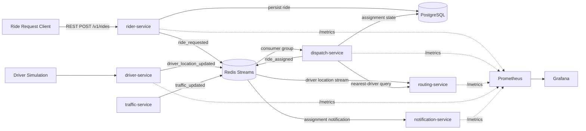
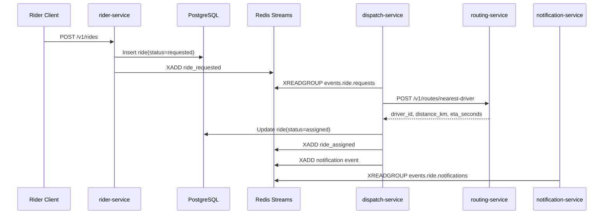
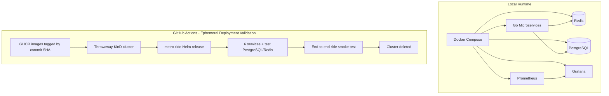

# MetroRide

[](https://github.com/96528025/MetroRide/actions/workflows/ci.yml)


MetroRide is a production-style distributed ride dispatch platform focused on event-driven backend architecture and cloud-native infrastructure engineering. Its default Docker Compose profile runs six core Go application services, with Redis Streams for asynchronous coordination, PostgreSQL for durable ride state, and an observability stack built around Prometheus and Grafana. An optional Kafka profile adds a seventh application role, `analytics-service`, for driver-location telemetry.

The project is designed as a backend systems portfolio artifact: the emphasis is service ownership, event contracts, failure boundaries, operational visibility, and a path from local Docker Compose to Kubernetes-based deployment.

## Default Core System Architecture


```mermaid
flowchart LR
    RiderClient[Ride Request Client] -->|REST POST /v1/rides| Rider[rider-service]
    DriverSim[Driver Simulation] --> Driver[driver-service]

    Rider -->|persist ride| Postgres[(PostgreSQL)]
    Rider -->|ride_requested| Redis[(Redis Streams)]
    Driver -->|driver_location_updated| Redis
    Traffic[traffic-service] -->|traffic_updated| Redis

    Redis -->|consumer group| Dispatch[dispatch-service]
    Redis -->|driver location stream| Routing[routing-service]
    Dispatch -->|nearest-driver query| Routing
    Dispatch -->|assignment state| Postgres
    Dispatch -->|ride_assigned| Redis
    Redis -->|assignment notification| Notification[notification-service]

    Rider -.->|/metrics| Prometheus[Prometheus]
    Dispatch -.->|/metrics| Prometheus
    Routing -.->|/metrics| Prometheus
    Driver -.->|/metrics| Prometheus
    Notification -.->|/metrics| Prometheus
    Prometheus --> Grafana[Grafana]
```

The default profile contains six application service roles: rider, driver, dispatch, routing, traffic, and notification. With PostgreSQL, Redis, Prometheus, and Grafana, that is 10 default Compose components. The optional `kafka` profile adds `analytics-service`, a second `driver-service` runtime instance named `driver-kafka-producer`, a Kafka broker, and the one-shot `kafka-init` job, bringing the profile-expanded Compose inventory to 14 components. The producer instance is not an eighth application role, and the init job is not a long-running service; the producer runs the existing driver-service binary with Kafka publishing enabled.

## Event Flow


```mermaid
sequenceDiagram
    participant Client as Rider Client
    participant Rider as rider-service
    participant DB as PostgreSQL
    participant Bus as Redis Streams
    participant Dispatch as dispatch-service
    participant Routing as routing-service
    participant Notify as notification-service

    Client->>Rider: POST /v1/rides
    Rider->>DB: Insert ride(status=requested)
    Rider->>Bus: XADD ride_requested
    Dispatch->>Bus: XREADGROUP events.ride.requests
    Dispatch->>Routing: POST /v1/routes/nearest-driver
    Routing-->>Dispatch: driver_id, distance_km, eta_seconds
    Dispatch->>DB: Update ride(status=assigned)
    Dispatch->>Bus: XADD ride_assigned
    Dispatch->>Bus: XADD notification event
    Notify->>Bus: XREADGROUP events.ride.notifications
```

## Infrastructure Topology


```mermaid
flowchart TB
    subgraph Local["Local Runtime"]
        Compose[Docker Compose]
        Compose --> GoServices[Go Microservices]
        Compose --> Redis[(Redis)]
        Compose --> Postgres[(PostgreSQL)]
        Compose --> Prometheus[Prometheus]
        Compose --> Grafana[Grafana]
    end

    subgraph CI["GitHub Actions - Ephemeral Deployment Validation"]
        Images[GHCR images tagged by commit SHA]
        Kind[Throwaway KinD cluster]
        Helm[metro-ride Helm release]
        Images --> Kind
        Kind --> Helm
        Helm --> Workloads[6 services + test PostgreSQL/Redis]
        Workloads --> Smoke[End-to-end ride smoke test]
        Smoke --> Teardown[Cluster deleted]
    end

    Prometheus --> Grafana
    GoServices --> Redis
    GoServices --> Postgres
```

## Service Ownership

| Service role | Startup | Responsibility | Communication Pattern |
| --- | --- | --- | --- |
| `rider-service` | Default | Accepts ride requests, persists rider-facing state, emits `ride_requested`. | REST ingress, PostgreSQL writes, Redis Streams publish |
| `driver-service` | Default | Simulates live driver coordinates and availability. | Redis Streams publish |
| `dispatch-service` | Default | Consumes ride requests, coordinates driver assignment, persists assignment state. | Redis Streams consumer group, REST call to routing, PostgreSQL writes |
| `routing-service` | Default | Maintains available driver state and calculates nearest-driver ETA. | REST API, Redis Streams consumer |
| `traffic-service` | Default | Produces dynamic congestion updates for future route weighting. | Redis Streams publish |
| `notification-service` | Default | Consumes assignment events and simulates rider/driver delivery. | Redis Streams consumer group |
| `analytics-service` | Optional `kafka` profile | Maintains a queryable view of driver telemetry from Kafka. | Kafka consumer group, REST read API |

## Technology Stack

- **Language:** Go for all current backend services.
- **Event transport:** Redis Streams with consumer groups for the core asynchronous workflow; optional Kafka for driver-location telemetry.
- **Storage:** PostgreSQL as the system of record for ride and assignment state.
- **APIs:** REST for synchronous service boundaries, with protobuf/gRPC scaffolding reserved in `shared/proto`.
- **Observability:** Prometheus metrics, Grafana dashboards, structured JSON logs, health and readiness probes.
- **Runtime:** Docker Compose for local orchestration.
- **Cloud-native deployment:** Helm chart deployed to an ephemeral KinD cluster on every CI run, plus raw Kubernetes manifests. Validation only; no hosted environment.

## Distributed Systems Design

MetroRide separates state mutation, assignment coordination, routing computation, and notification delivery into independently deployable services. Ride intake is synchronous only at the API boundary; downstream dispatch work is asynchronous through Redis Streams. This design keeps rider request latency decoupled from assignment processing, makes dispatch consumers horizontally scalable, and provides a foundation for replay, backpressure handling, and transport migration.

Redis Streams are used as the core workflow event log because they provide persistent streams, consumer groups, explicit acknowledgements, and simple local development ergonomics. The event envelope in `shared/pkg/events` keeps transport concerns isolated so the optional Kafka usage can expand to additional streams later without rewriting domain payloads.

PostgreSQL remains the authoritative store for ride status. Redis carries workflow events; it does not own long-term ride truth. This separation mirrors production systems where event logs coordinate distributed work while relational storage protects transactional state and queryability.

## System Design Narrative

MetroRide is a production-style local distributed systems project designed to demonstrate backend infrastructure concepts: service decomposition, asynchronous workflow coordination, durable state, reliability controls, and observability. It is not presented as a real production deployment at scale; it is structured so the architecture can be explained and extended like a production backend system.

- [System design](docs/system-design.md)
- [Architecture decisions](docs/architecture-decisions.md)

## Observability

Every service exposes:

- `GET /healthz`
- `GET /readyz`
- `GET /metrics`

Key metrics include:

- `metroride_ride_requests_total`
- `metroride_dispatch_latency_seconds`
- `metroride_rides_assigned_total`
- `metroride_assignment_failures_total`
- `metroride_stream_consume_errors_total`
- `metroride_dependency_errors_total`
- `metroride_routing_computation_seconds`
- `metroride_active_drivers`

Prometheus scrapes service metrics, and Grafana provisions a MetroRide dashboard with ride request rate, dispatch latency, routing latency, active drivers, and assignment failures.

See [docs/observability.md](docs/observability.md) for the monitoring strategy.

## Reliability and Failure Handling

MetroRide includes production hardening for dependency-aware readiness checks, bounded timeouts, retry behavior, idempotent ride assignment, and a Redis dead-letter stream for failed dispatch events.

See [docs/reliability.md](docs/reliability.md) for timeout strategy, retry behavior, idempotency design, dead-letter semantics, and expected behavior during Redis, PostgreSQL, routing, and dispatch failures.

## Optional Kafka Streaming Extension

MetroRide includes a lightweight optional Kafka profile for driver location telemetry. The core Redis Streams dispatch workflow is unchanged; Kafka is used only to demonstrate topic-based streaming, producers, consumers, consumer groups, partition keys, and replay concepts.

Kafka does not start by default:

```bash
docker compose up -d
```

Start the optional Kafka extension explicitly:

```bash
docker compose --profile kafka up -d
ENABLE_KAFKA_SMOKE=true bash scripts/smoke-test.sh
```

See [docs/kafka-lightweight-extension.md](docs/kafka-lightweight-extension.md).

## Continuous Integration and Delivery

Every change to MetroRide is tested, packaged and **actually deployed** before
it is considered good. One GitHub Actions workflow does all of it, and it
behaves differently depending on how much the code is trusted.

**On every pull request** the pipeline runs formatting and vet checks, the Go
package tests, Docker Compose config validation and image builds, then starts
the full stack and runs smoke tests, integration tests and a real
routing-outage dead-letter failure test. It then builds the six service images
inside the runner, spins up a throwaway Kubernetes cluster (KinD), loads those
images into it, installs the Helm release and runs an end-to-end ride through
the deployed system. Pull requests never publish container images and never
need registry access.

**On a push to `main`** (or a `v*` release tag, or a manual run) the same
validation runs first, and only then are the six images published to the GitHub
Container Registry, each tagged with the full commit SHA. The pipeline then
authenticates back to the registry, **pulls those exact published images down
again**, deploys them to a fresh throwaway Kubernetes cluster and runs the same
end-to-end ride test. That round trip is the point: it proves the published
artifacts are real, retrievable and runnable, rather than assuming a successful
`docker push` means a working release.

Published images look like this — an immutable commit SHA, never `latest`:

```text
ghcr.io/96528025/metroride-rider-service:<full-commit-sha>
ghcr.io/96528025/metroride-driver-service:<full-commit-sha>
ghcr.io/96528025/metroride-dispatch-service:<full-commit-sha>
ghcr.io/96528025/metroride-routing-service:<full-commit-sha>
ghcr.io/96528025/metroride-traffic-service:<full-commit-sha>
ghcr.io/96528025/metroride-notification-service:<full-commit-sha>
```

All six are built from one shared Dockerfile with the service name as a build
argument; there are no duplicated per-service Dockerfiles. Authentication uses
the token GitHub provides to the workflow automatically, so no personal access
token or long-lived credential exists anywhere in this repository.

In both paths the images are side-loaded into the cluster with
`kind load docker-image` and deployed with `imagePullPolicy: IfNotPresent`, so
the cluster itself never contacts a registry and there is no Kubernetes image
pull secret to manage.

### The deployed test

The Kubernetes deployment is not just "did the pods start". After every
required workload reports Available and every service answers `/healthz` and
`/readyz`, the pipeline posts a real ride request:

```http
POST /v1/rides  ->  HTTP 202
{"rider_id":"smoke-rider","pickup_lat":37.775,"pickup_lng":-122.419,"dropoff_lat":37.789,"dropoff_lng":-122.401}
```

and then waits for `GET /v1/rides/<ride_id>` to report `"status":"assigned"`
with a driver attached. Getting there means the whole distributed path worked:
the ride was persisted to PostgreSQL, `ride_requested` was published to Redis
Streams, `dispatch-service` consumed it through its consumer group, called
`routing-service` for the nearest driver, and committed the assignment. The
result is then confirmed independently in PostgreSQL and through
`notification-service`'s statistics endpoint. If anything fails, the workflow
dumps pod, deployment, service, event, describe and log output — including
previous-container logs for anything that crash-looped — and deletes the
cluster regardless of outcome.

### The Kubernetes environment is ephemeral

The KinD cluster lives for a few minutes inside a GitHub Actions runner and is
then deleted. **It is deployment validation, not production hosting.** No cloud
account, managed Kubernetes cluster, custom domain, public ingress, or paid or
persistent infrastructure of any kind is created by this project.

Prometheus and Grafana are deliberately left out of that ephemeral deployment:
the ride flow under test does not exercise them, and omitting them keeps the
cluster within a free runner's resources. Their Docker Compose support is
unchanged — every service still exposes `/metrics`, Grafana still provisions
the MetroRide dashboard locally, and the Helm chart still renders a
`ServiceMonitor` on clusters that have the Prometheus Operator.

### Test coverage that already existed

Automated coverage includes happy-path ride assignment, duplicate-event
idempotency, a real routing outage created by stopping `routing-service`,
dispatch retry exhaustion through the production retry path, and dead-letter
verification in the real `events.dead_letter` Redis Stream including
confirmation that the ride remains unassigned in PostgreSQL.

The suite does not claim coverage of every dependency or recovery mode.

See [docs/cicd.md](docs/cicd.md) for the full pipeline, permission model,
image strategy and local reproduction commands, and
[docs/testing-and-ci.md](docs/testing-and-ci.md) for the test layers.

## Repository Layout

```text
.
├── docker-compose.yml
├── docs/
│   ├── api.md
│   ├── architecture.md
│   ├── architecture-decisions.md
│   ├── cicd.md
│   ├── kafka-lightweight-extension.md
│   ├── observability.md
│   ├── reliability.md
│   ├── system-design.md
│   └── testing-and-ci.md
├── infrastructure/
│   ├── docker/                  # one Dockerfile, SERVICE as a build arg
│   ├── grafana/
│   ├── helm/                    # metro-ride chart + ephemeral KinD profiles
│   ├── k8s/
│   ├── kind/                    # ephemeral cluster definition
│   └── prometheus/
├── scripts/
│   ├── ci/                      # tool install + Helm chart validation
│   ├── lib/                     # shared image naming and KinD settings
│   ├── build-images.sh
│   ├── pull-images.sh
│   ├── kind-up.sh
│   ├── kind-load-images.sh
│   ├── kind-deploy.sh
│   ├── kind-smoke-test.sh
│   ├── kind-diagnostics.sh
│   ├── kind-down.sh
│   ├── failure-integration-test.sh
│   └── smoke-test.sh
├── services/
│   ├── analytics-service/       # optional kafka profile
│   ├── dispatch-service/
│   ├── driver-service/
│   ├── notification-service/
│   ├── rider-service/
│   ├── routing-service/
│   └── traffic-service/
├── tests/
│   ├── failureintegration/
│   └── integration/
└── shared/
    ├── events/
    ├── pkg/
    └── proto/
```

## Local Development

Start the platform:

```bash
docker compose up --build
```

Create a ride:

```bash
curl -X POST http://localhost:8080/v1/rides \
  -H 'Content-Type: application/json' \
  -d '{"rider_id":"rider-42","pickup_lat":37.775,"pickup_lng":-122.419,"dropoff_lat":37.789,"dropoff_lng":-122.401}'
```

Query the ride state:

```bash
curl http://localhost:8080/v1/rides/<ride_id>
```

Run the smoke test:

```bash
bash scripts/smoke-test.sh
```

## Runtime Ports

| Component | Port |
| --- | ---: |
| `rider-service` | `8080` |
| `driver-service` | `8081` |
| `dispatch-service` | `8082` |
| `routing-service` | `8083` |
| `traffic-service` | `8084` |
| `notification-service` | `8085` |
| `analytics-service` (optional `kafka` profile) | `8086` |
| Prometheus | `9090` |
| Grafana | `3000` |
| PostgreSQL | `5432` |
| Redis | `6379` |

Grafana defaults to `admin` / `admin`.

## Deployment

Docker Compose is the primary local runtime:

```bash
docker compose up --build
```

Raw Kubernetes manifests live in `infrastructure/k8s`:

```bash
kubectl apply -f infrastructure/k8s/namespace.yaml
kubectl apply -f infrastructure/k8s/
```

The Helm chart in `infrastructure/helm/metro-ride` is what CI actually deploys.
It renders `ghcr.io/96528025/metroride-<service>:<tag>` image references, and
its ephemeral profile adds test-only PostgreSQL and Redis so a throwaway
cluster contains every dependency the ride flow needs:

```bash
# validate the chart in every configuration it is installed in
bash scripts/ci/validate-helm-chart.sh

# stand up the whole thing on a local KinD cluster, exactly as CI does
export IMAGE_TAG="$(git rev-parse HEAD)" IMAGE_SOURCE=pr
bash scripts/build-images.sh
bash scripts/kind-up.sh
bash scripts/kind-load-images.sh
bash scripts/kind-deploy.sh
bash scripts/kind-smoke-test.sh
bash scripts/kind-down.sh
```

**That cluster is ephemeral deployment validation, not production hosting.** It
is created inside a CI runner (or on your machine), used for a few minutes and
deleted. This project deploys to no cloud account and creates no persistent or
paid infrastructure. Persistent volumes, secrets management, ingress and
autoscaling remain deliberately out of scope; the chart is structured so they
could be layered in without changing service code.

See [docs/cicd.md](docs/cicd.md) for the full delivery pipeline.

## Documentation

- [Architecture](docs/architecture.md)
- [System design](docs/system-design.md)
- [Architecture decisions](docs/architecture-decisions.md)
- [API](docs/api.md)
- [Kafka lightweight extension](docs/kafka-lightweight-extension.md)
- [Observability](docs/observability.md)
- [Reliability](docs/reliability.md)
- [Testing and CI](docs/testing-and-ci.md)
- [CI/CD pipeline](docs/cicd.md)

## Scalability Roadmap

- **Kafka migration:** Replace Redis Streams with Kafka while preserving the shared event envelope.
- **gRPC service mesh:** Move dispatch-to-routing calls to protobuf/gRPC with deadlines and retries.
- **Distributed tracing:** Add OpenTelemetry spans across ride intake, stream consumption, routing, and notification delivery.
- **Autoscaling:** Scale dispatch consumers based on stream lag and assignment latency.
- **Multi-region deployment:** Partition drivers and rides by region, then replicate critical events across regions.
- **AI-assisted ETA prediction:** Introduce an ETA model service using traffic, driver, and route features.
- **Demand forecasting:** Add regional demand prediction to pre-position driver supply.
- **Resilience hardening:** Add dead-letter replay tooling, transactional outbox delivery, retry budgets, and circuit breakers.
