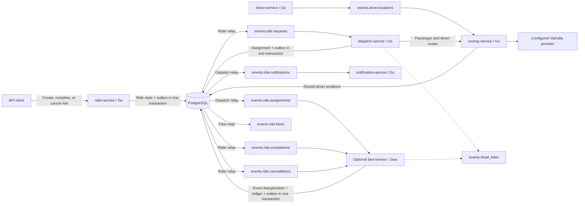

# MetroRide — Event-Driven Dispatch and Fare Settlement

[](https://github.com/96528025/MetroRide/actions/workflows/ci.yml)


MetroRide is an event-driven ride-dispatch backend built with Go, PostgreSQL, and Redis Streams, with an optional Java/Spring Boot fare service. It uses road-route estimates for passenger-trip quotes, reserves drivers during active assignments, and recovers unfinished stream deliveries after a consumer restart.

The application models ride acceptance, assignment, completion, cancellation, and a double-entry fare ledger. Driver locations are simulated, and fare settlement records accounting entries without moving money. There is no rider or driver frontend; Grafana provides operational dashboards. The optional Kafka extension carries driver-location telemetry separately from the ride workflow.

## Engineering highlights

| Problem | Implemented approach | Evidence |
| --- | --- | --- |
| Database commits but event publishing fails | Domain changes and outbox rows commit in one PostgreSQL transaction; a relay retries publishing to Redis | [`shared/pkg/outbox`](shared/pkg/outbox), Redis-outage and process-kill recovery scripts |
| A ride request is delivered again | Conditional `requested → assigned` update and assignment insert in one transaction | [`dispatch-service`](services/dispatch-service/cmd/main.go), duplicate-event integration test |
| Completion or settlement is attempted twice | Conditional `assigned → completed` update; fare event-ID deduplication, persistent per-ride row lock, per-ride unique indexes | [`rider-service`](services/rider-service/cmd/main.go), [`fare-service`](services/fare-service/README.md), concurrent completion/settlement tests |
| A consumer crashes or receives unusable data | Go and Java consumers reclaim pending entries and dead-letter failed work before acknowledging | `RideEventConsumer`, `FailureHandler`, Testcontainers recovery tests |
| Images build but fail when deployed | CI installs the six core images through Helm into KinD and drives a ride through the deployed stack | [Deployment workflow](.github/workflows/deploy-validation.yml) |

## Run a ride through fare settlement

Prerequisites: Docker with Compose, Bash, curl, and network access for image downloads and the configured route provider. Start fare-service before creating the ride:

```bash
docker compose --profile fare up --build -d
```

Create a new ride:

```bash
curl -X POST http://localhost:8080/v1/rides \
  -H 'Content-Type: application/json' \
  -d '{"rider_id":"rider-42","pickup_lat":37.775,"pickup_lng":-122.419,"dropoff_lat":37.789,"dropoff_lng":-122.401}'
```

Copy this response's `ride_id`, then poll until the ride is assigned and its quote hold exists:

```bash
RIDE_ID='paste-the-new-ride-id-here'
curl "http://localhost:8080/v1/rides/$RIDE_ID"
curl "http://localhost:8087/v1/rides/$RIDE_ID/ledger"
```

Complete the ride and poll the ledger until it contains the hold reversal and settlement:

```bash
curl -X POST "http://localhost:8080/v1/rides/$RIDE_ID/complete"
curl "http://localhost:8087/v1/rides/$RIDE_ID/ledger"
```

HTTP `202` confirms the ride state change; fare processing is asynchronous. To cancel instead, call `/cancel` before completing the ride. Inspect the ride and ledger to confirm the result.

```bash
docker compose --profile fare down
```

This stops the stack and preserves its data volumes.

For the automated flow, run `bash scripts/fare-e2e-test.sh` with the application's ports free. It creates and removes its own Compose project, uses an explicit local route fixture, and checks the ledger and outgoing settlement event. Go is optional for this script because it can run the test client in a Go container.

## Architecture


```mermaid
flowchart LR
    C[API client] -->|Create, complete, or cancel ride| Rider[rider-service / Go]
    Rider -->|Ride state + outbox in one transaction| DB[(PostgreSQL)]
    DB -->|Rider relay| Requests[events.ride.requests]
    Requests --> Dispatch[dispatch-service / Go]
    Driver[driver-service / Go] --> Locations[events.driver.locations]
    Locations --> Routing[routing-service / Go]
    Routing -->|Shared driver positions| DB
    Routing --> Provider[Configured Valhalla provider]
    Dispatch -->|Passenger and driver routes| Routing
    Dispatch -->|Assignment + outbox in one transaction| DB
    DB -->|Dispatch relay| Assignments[events.ride.assignments]
    DB -->|Dispatch relay| Notifications[events.ride.notifications]
    Notifications --> Notify[notification-service / Go]
    DB -->|Rider relay| Completions[events.ride.completions]
    Assignments --> Fare[Optional fare-service / Java]
    Completions --> Fare
    DB -->|Rider relay| Cancellations[events.ride.cancellations]
    Cancellations --> Fare
    Fare -->|Event deduplication + ledger + outbox in one transaction| DB
    DB -->|Fare relay| Fares[events.ride.fares]
    Dispatch -.-> DLQ[events.dead_letter]
    Fare -.-> DLQ
```

The core data path uses HTTP/JSON, PostgreSQL, and Redis Streams. The repository's `shared/proto` directory is not evidence of an implemented gRPC transport. Traffic simulation and optional Kafka telemetry are separate from the dispatch path shown above.

| Service | Port | Responsibility | Default stack |
| --- | ---: | --- | --- |
| `rider-service` | 8080 | Create/read rides, complete or cancel rides, publish through its outbox relay | Yes |
| `driver-service` | 8081 | Publish locations for four simulated drivers every two seconds | Yes |
| `dispatch-service` | 8082 | Consume requests, call routing, persist assignment and two outbox destinations | Yes |
| `routing-service` | 8083 | Share driver positions in PostgreSQL; compare road approaches | Yes |
| `traffic-service` | 8084 | Publish simulated congestion every ten seconds; currently no consumer | Yes |
| `notification-service` | 8085 | Log and count notification deliveries | Yes |
| `analytics-service` | 8086 | Expose latest driver locations consumed from Kafka | Optional `kafka` profile |
| `fare-service` | 8087 | Process ride events; quote, settle or reverse holds, expose the ledger, and publish `fare_settled` | Optional `fare` profile |

## A ride from request to settlement

1. Accept the request and publish it through the rider outbox.
2. Select a driver using a road-route shortlist, then reserve that driver and commit the assignment together.
3. With fare-service enabled, create a quote hold from the passenger route and save the pricing inputs.
4. Complete the ride to settle the saved quote, or cancel it without a fee. Either transition releases the driver; cancellation reverses any existing hold.

The routing model provides estimates, while driver movement remains simulated. For selection rules and provider settings, see [road routing](docs/routing.md). The [API reference](docs/api.md#rider-service) describes the request and response contracts.

## Fare ledger and pricing boundary

Fare-service keeps an append-only ledger: a quote hold is followed by reversal and settlement, or by a cancellation reversal. The quote-time rate card and driver share remain attached to the ride. The [fare guide](services/fare-service/README.md#fare-and-ledger) defines the calculation, posting rules, cancellation ordering, and legacy-hold policy.

For an existing database, follow the [migration instructions](docs/routing.md#event-version-and-existing-databases) before starting the new services. Conflicting historical driver assignments require explicit resolution.

## Reliability and operational limits

Transactional outboxes connect database changes to event publication. Consumers can reclaim unfinished deliveries after restart, but redelivery is still possible; state guards protect assignments and ledger writes. Notification logs and counters may repeat. See [failure recovery](docs/reliability.md) for retry limits, acknowledgment ordering, and timeout settings.

Redis persistence and retention, external routing availability, and manual dead-letter replay remain operational concerns. The application has no client-create deduplication, authentication, payment collection, actual-trip metering, or production availability guarantee.

## Verification

Local package checks require Go 1.22; Maven checks require Java 21 and Docker.

Go tests cover HTTP and event contracts, route-response validation, driver selection, consumer recovery, and guarded state transitions. Integration tests use PostgreSQL and Redis to exercise concurrent reservations, completion/cancellation races, transaction rollback, and restart recovery. The fare flow follows a ride through the Go services and Java ledger and verifies publication of the resulting event. Test output is the source of truth for case counts.

The Go race detector instruments the Go test processes. It does not instrument service binaries running in separately built containers. Fixture-based routing tests do not measure real travel times or prove the availability of a public routing service.

```bash
go test -race ./...
go vet ./...
(cd services/fare-service && ./mvnw verify)
bash scripts/fare-e2e-test.sh
```

Real Redis and PostgreSQL checks in the routing and shared consumer packages run when `TEST_REDIS_ADDR` and `TEST_POSTGRES_DSN` are set. See [testing and CI](docs/testing-and-ci.md) for the isolated fixture stack, outage checks, and KinD validation.

## Delivery pipeline and optional Kafka

[CI](.github/workflows/ci.yml) validates Go formatting, vet/tests, Compose, smoke/integration, and outage recovery. A separate Java job runs Maven `verify`, and a third job runs the ride-to-fare-settlement flow against a Compose stack with the `fare` profile. Six core images are built as distroless, non-root containers.

- **Pull requests:** build images in the runner, load them into KinD, install the Helm release, and run deployment smoke checks without publishing service images.
- **Main, release tags, manual runs:** publish core images tagged with the full commit SHA to GHCR, pull those artifacts into the deployment-validation job, and run the same KinD checks. No `latest` tag is used.
- **Scope:** the publish job depends on Go backend validation; fare validation and the fare flow job are separate jobs and not dependencies of image publication. Fare and analytics are outside the six-image release/Helm smoke path: the flow job proves the Go-to-Java chain works in Compose, it does not put fare-service into GHCR, the Helm chart or KinD. KinD clusters are removed after validation.

The [Helm chart](infrastructure/helm/metro-ride) includes probes, resource settings, bounded dependency waits, and optional `ServiceMonitor` rendering. Default dependencies are external PostgreSQL/Redis; KinD profiles use disposable `emptyDir`-backed instances. Local deployment validation needs Docker, kind, kubectl, Helm, and Bash 4+; see [CI/CD documentation](docs/cicd.md).

The optional Kafka profile runs a non-persistent single KRaft broker, a three-partition driver-location topic keyed by `driver_id`, a separate telemetry producer, and the analytics consumer:

```bash
docker compose --profile kafka up --build -d
ENABLE_KAFKA_SMOKE=true bash scripts/smoke-test.sh
```

Kafka is a telemetry extension; Redis Streams remains the ride workflow transport.

## Repository guide

[Architecture](docs/architecture.md) · [Design decisions](docs/system-design.md) · [Road routing](docs/routing.md) · [API](docs/api.md) · [Reliability](docs/reliability.md) · [Fare service](services/fare-service/README.md) · [Observability](docs/observability.md) · [Testing](docs/testing-and-ci.md) · [Deployment](docs/cicd.md) · [Kafka extension](docs/kafka-lightweight-extension.md)

The root README describes the combined current workflow. Service-specific source, migrations, and tests provide the detailed behavioral contracts.

## License

MIT. See [LICENSE](LICENSE).
