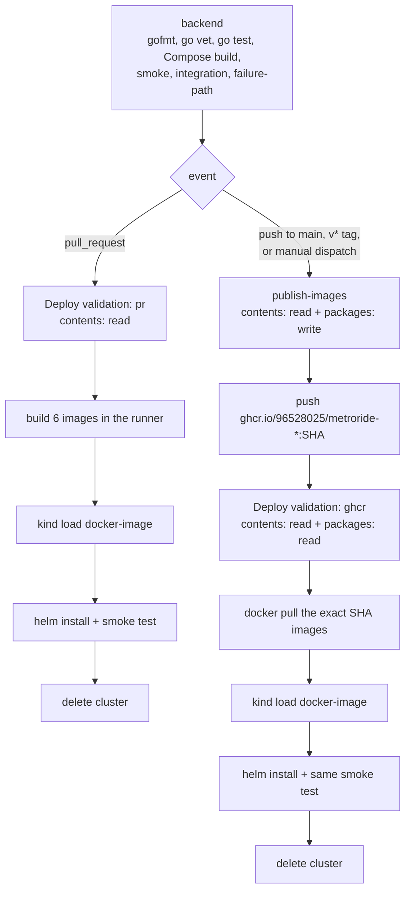

# MetroRide CI/CD

[](https://github.com/96528025/MetroRide/actions/workflows/ci.yml)

MetroRide is validated by a single GitHub Actions workflow that tests the Go
services, publishes immutable container images, deploys them to a disposable
Kubernetes cluster and runs an end-to-end ride flow against that deployment.

Everything described here runs inside GitHub-hosted runners. **No cloud
account, no managed Kubernetes, no hosting provider and no persistent
infrastructure of any kind is created.** The Kubernetes cluster exists for a
few minutes inside one runner and is then destroyed.

## Workflows

| File | Purpose |
| --- | --- |
| `.github/workflows/ci.yml` | Validation, GHCR publishing, and both deployment-validation entry points. |
| `.github/workflows/deploy-validation.yml` | Reusable ephemeral-Kubernetes job called by both paths. |

## Pipeline shape



Publishing is impossible unless validation passed: `publish-images` declares
`needs: backend`, and it is additionally guarded on the event so a pull request
can never reach it.

## Pull requests

Pull requests are untrusted code. They **never publish images** and never need
registry access at all.

1. `backend` runs the full existing validation suite (see below).
2. `deploy-validation.yml` runs with `image_source: pr`:
   1. Build the six service images in the runner, tagged with the commit SHA.
   2. Create an ephemeral single-node KinD cluster.
   3. `kind load docker-image` each image into the cluster.
   4. `helm upgrade --install` with `imagePullPolicy: IfNotPresent`.
   5. Wait for every required Deployment, then run the smoke test.
   6. Collect diagnostics if anything failed.
   7. Delete the cluster in an `if: always()` step.

Because the images are side-loaded and the pull policy is `IfNotPresent`, the
kubelet never contacts a registry. Pull-request validation therefore does not
depend on GHCR availability, package visibility, or image pull secrets.

The job is granted `contents: read` only.

## Trusted delivery (`main`, `v*` tags, manual dispatch)

Trusted events are: a push to `main`, a push of a `v*` tag, and a manual
`workflow_dispatch` (which only accounts with write access to the repository
can start).

1. `backend` runs the same validation suite.
2. `publish-images` (matrix, one runner per service, `packages: write`):
   1. Authenticate to GHCR with the automatically provided `GITHUB_TOKEN`.
      No PAT and no long-lived credential is used or stored.
   2. Build the service image and push it under the **full commit SHA**.
   3. On a `v*` tag, additionally push that human-readable tag.
3. `deploy-validation.yml` runs with `image_source: ghcr` (`packages: read`):
   1. Authenticate the runner to GHCR with `GITHUB_TOKEN`.
   2. `docker pull` the exact SHA-tagged images back and print their resolved
      digests into the run log.
   3. `docker logout` — the credential is discarded *before* the cluster is
      created, because it is never needed inside Kubernetes.
   4. Create a fresh ephemeral KinD cluster.
   5. `kind load docker-image` the pulled images.
   6. Deploy with Helm using those exact tags and `IfNotPresent`.
   7. Run the **same** smoke test used for pull requests.
   8. Diagnostics on failure, unconditional cluster deletion.

This sequence is what makes the delivery claim checkable rather than assumed.
It proves, in order, that the images were really published, that they can be
authenticated for and retrieved, that those exact published artifacts run, and
that the running deployment passes health and functional validation.

### Why no `imagePullSecret`

The runner already holds a GHCR credential for the duration of the pull step,
and `kind load docker-image` moves images into the node's image store
directly. Putting a registry credential inside the cluster would add a secret,
a failure mode and a Kubernetes-side dependency on package visibility, and buy
nothing. There is no `imagePullSecret` anywhere in this repository.

## Image naming and tagging

```text
ghcr.io/96528025/metroride-rider-service:<full-commit-sha>
ghcr.io/96528025/metroride-driver-service:<full-commit-sha>
ghcr.io/96528025/metroride-dispatch-service:<full-commit-sha>
ghcr.io/96528025/metroride-routing-service:<full-commit-sha>
ghcr.io/96528025/metroride-traffic-service:<full-commit-sha>
ghcr.io/96528025/metroride-notification-service:<full-commit-sha>
```

- **Immutable tag:** always the full 40-character commit SHA. Deployments only
  ever reference this tag.
- **Optional release tag:** a `v*` tag push adds that tag to the same images.
  It is a convenience label, never a deployment target.
- **No `latest`.** Nothing is published as `latest` and nothing is deployed
  from a floating tag.
- **Lowercase.** GHCR rejects uppercase path components. The owner is already
  lowercase, and `scripts/lib/images.sh` normalises registry, namespace and
  prefix anyway so a capitalised override cannot produce an invalid reference.
- **One Dockerfile.** All six images come from
  `infrastructure/docker/Dockerfile.service` with `SERVICE` as a build
  argument. There are no duplicate per-service Dockerfiles.
- **One source of truth.** `scripts/lib/images.sh` defines the service list and
  the naming rule; the Helm chart renders the identical reference from
  `values.yaml`. `scripts/kind-load-images.sh` then derives what to load from
  the *rendered manifests*, so the chart and the loader cannot drift.

`analytics-service` is not published: it only runs under the optional Kafka
Compose profile and is not part of the core released set.

## The ephemeral Kubernetes environment

- **Tooling:** KinD `v0.30.0`, kubectl `v1.34.1`, Helm `v3.19.0`, all pinned in
  `scripts/ci/install-k8s-tools.sh` so a runner-image change cannot silently
  alter the Kubernetes version under test. Node image: `kindest/node:v1.34.0`.
- **Shape:** one control-plane node (`infrastructure/kind/cluster.yaml`).
- **Timeout:** the deployment-validation job is capped at 30 minutes.
- **Retries:** cluster creation gets exactly one retry, because image unpack and
  control-plane startup are the only genuinely transient steps. Nothing else is
  retried; a second failure is a real failure and surfaces as one.
- **Cleanup:** `scripts/kind-down.sh` runs under `if: always()`.
- **Lifetime:** minutes. It is deployment validation, not hosting.

### What the chart deploys

The six core services, plus chart-owned **test-only** PostgreSQL and Redis
(`dependencies.enabled=true` in `values-kind.yaml`). These are plain
Deployments with `emptyDir` storage and Services giving deterministic in-cluster
DNS (`postgres:5432`, `redis:6379`) that matches the service configuration. No
Bitnami or other external dependency chart is used. The database schema is
supplied at install time with
`--set-file dependencies.postgres.initSql=infrastructure/docker/postgres/init.sql`,
so the schema has exactly one source of truth, shared with Docker Compose.

**Prometheus and Grafana are intentionally excluded from this profile.** The
ride flow under validation does not exercise them, and omitting them keeps the
cluster inside a GitHub-hosted runner's resources. Their Docker Compose support
is unchanged and the project's observability story is unaffected — every service
still exposes `/metrics`, and the chart still renders a `ServiceMonitor` when a
cluster has the Prometheus Operator CRDs installed.

### Startup ordering

There are no fixed sleeps. Ordering comes from readiness:

- Bounded init containers block each service until its startup-critical data
  stores actually serve, checked with `redis-cli ping` and `pg_isready` rather
  than a port probe, using images the node already has. `rider-service` waits
  only for PostgreSQL; its Redis outbox relay can recover asynchronously.
- `dispatch-service`'s own `/readyz` reports not-ready until PostgreSQL, Redis,
  its Redis consumer group and `routing-service` all answer, so
  `helm --wait` blocks on real dependency health.

## Post-deployment smoke test

`scripts/kind-smoke-test.sh` opens `kubectl port-forward` to the six services
and then runs `scripts/smoke-test.sh` — the same script the Docker Compose
pipeline uses, so Compose and Kubernetes are validated by identical assertions.

**Deployments that must be Available:** `postgres`, `redis`, `rider-service`,
`driver-service`, `dispatch-service`, `routing-service`, `traffic-service`,
`notification-service`.

**Health and readiness:** `GET /healthz` and `GET /readyz` must return 2xx for
all six core services.

**The end-to-end request:**

```http
POST http://rider-service:8080/v1/rides
Content-Type: application/json

{"rider_id":"smoke-rider","pickup_lat":37.775,"pickup_lng":-122.419,"dropoff_lat":37.789,"dropoff_lng":-122.401}
```

**Expected response:** `HTTP 202 Accepted` with a body containing a `ride_id`
and `"status":"requested"`.

**Expected final state:** `GET /v1/rides/<ride_id>` returns `HTTP 200` with
`"status":"assigned"` and a non-empty `driver_id`.

Reaching that state requires the whole distributed path to work:
`rider-service` persisted the ride to PostgreSQL and published `ride_requested`
to the Redis stream, `dispatch-service` consumed it through its consumer group,
called `routing-service` for a nearest driver, and committed the assignment
transactionally.

**How the final state is observed** — three independent channels, each polled
with a bounded deadline:

1. **HTTP:** `GET /v1/rides/<ride_id>` reports `assigned` with a `driver_id`.
2. **PostgreSQL:** the `rides` row for that id has `status = 'assigned'` and a
   non-null `driver_id`, and exactly one `ride_assignments` row exists for it.
   Queried with `kubectl exec deploy/postgres -- psql`.
3. **Downstream consumer:** `notification-service`'s existing
   `GET /v1/notifications/stats` reports at least one processed event, showing
   the assignment propagated through the notification stream.

## Failure diagnostics

`scripts/kind-diagnostics.sh` runs only on failure (`if: failure()`) and always
exits 0, so it reports on the failure rather than replacing or masking it. The
original failing step is what fails the job. It collects:

- `kubectl get pods -A -o wide`, `get deployments -A`, `get services -A`
- `kubectl get events -A --sort-by=.metadata.creationTimestamp`
- `kubectl get nodes -o wide`, `kubectl top nodes`, `kubectl top pods -A`
- `helm status <release>` and `helm get values <release>`
- `kubectl describe` for every Deployment that is not fully available and every
  pod not Running/Succeeded
- current logs for every pod in the release namespace, including the test-only
  PostgreSQL and Redis
- previous-container logs for any pod that has restarted, which is where a
  crash loop's real cause is recorded

`scripts/kind-smoke-test.sh` additionally dumps its `kubectl port-forward` logs
if it fails.

## Permissions

| Job | Permissions | Why |
| --- | --- | --- |
| `backend` | `contents: read` (workflow default) | Only needs the source. |
| `deploy-validation-pull-request` | `contents: read` | Builds locally; never touches a registry. |
| `publish-images` | `contents: read`, `packages: write` | The only job that writes packages. |
| `deploy-validation-release` | `contents: read`, `packages: read` | Pulls published images back onto the runner. |

`deploy-validation.yml` declares no permissions of its own, so it inherits
exactly what the calling job grants.

Obsolete pull-request runs on the same ref are cancelled through the workflow's
`concurrency` group. Cancellation is disabled for pushes to `main` so a trusted
delivery run is never interrupted part-way through publishing.

## Running it locally

Everything CI does can be reproduced locally with Docker, KinD, kubectl and
Helm installed:

```bash
# 1. Static and package validation
gofmt -l .                     # must print nothing
go vet ./...
go test ./...

# 2. Docker Compose stack (the same suite CI's backend job runs)
docker compose config
docker compose build
docker compose up -d
bash scripts/smoke-test.sh
go test -count=1 -tags=integration ./tests/integration
bash scripts/failure-integration-test.sh
docker compose down -v

# 3. Helm chart validation
bash scripts/ci/validate-helm-chart.sh

# 4. Full ephemeral Kubernetes deployment validation (the pull-request path)
export IMAGE_TAG="$(git rev-parse HEAD)"
export IMAGE_SOURCE=pr
bash scripts/build-images.sh
bash scripts/kind-up.sh
bash scripts/kind-load-images.sh
bash scripts/kind-deploy.sh
bash scripts/kind-smoke-test.sh
bash scripts/kind-diagnostics.sh   # only useful after a failure
bash scripts/kind-down.sh
```

To reproduce the trusted-delivery path instead, authenticate to GHCR, then swap
step 4's build for a pull:

```bash
echo "$GITHUB_TOKEN" | docker login ghcr.io -u "$USER" --password-stdin
export IMAGE_SOURCE=ghcr
bash scripts/pull-images.sh
# ...then kind-up / kind-load-images / kind-deploy / kind-smoke-test / kind-down
```

## Deliberate non-goals

This pipeline does not implement, and this repository does not claim,
zero-downtime deployment, canary rollout, autoscaling, automated rollback,
security scanning, a public demo, a custom domain, public ingress, or any
persistent or paid hosting. Kubernetes is used here strictly as ephemeral
deployment validation.
